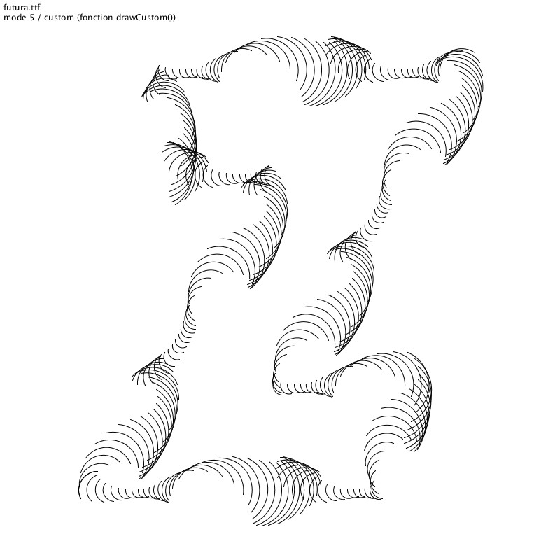
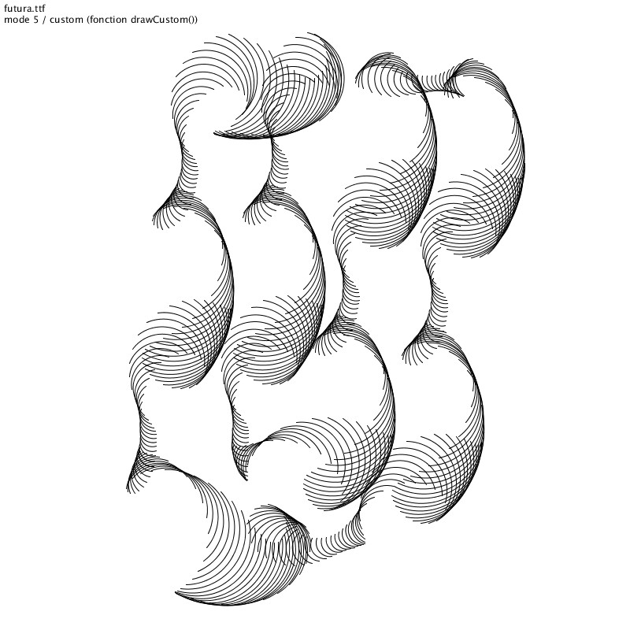
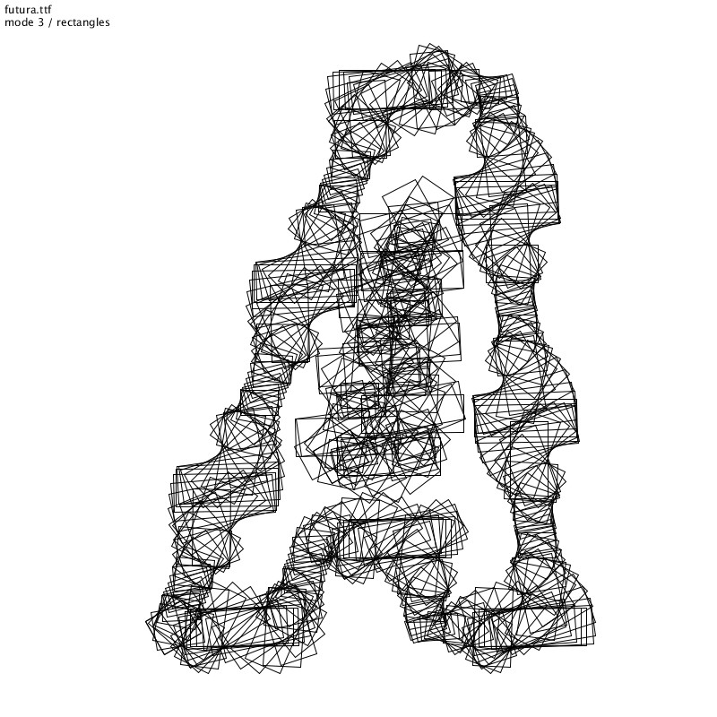
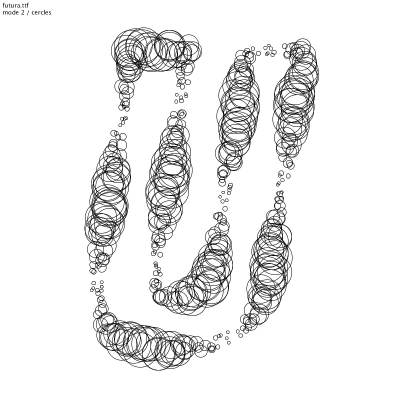
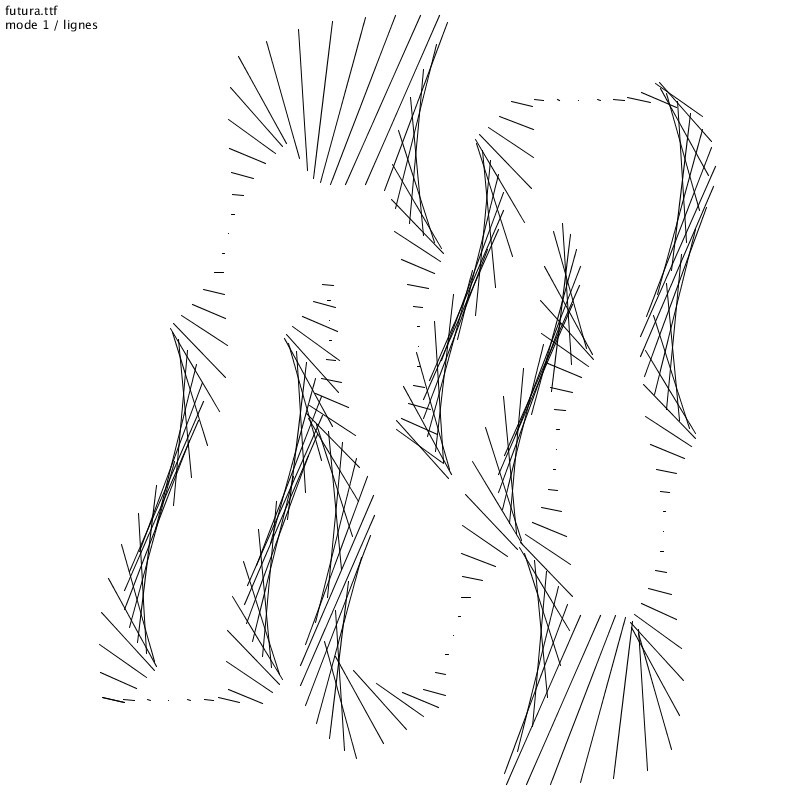
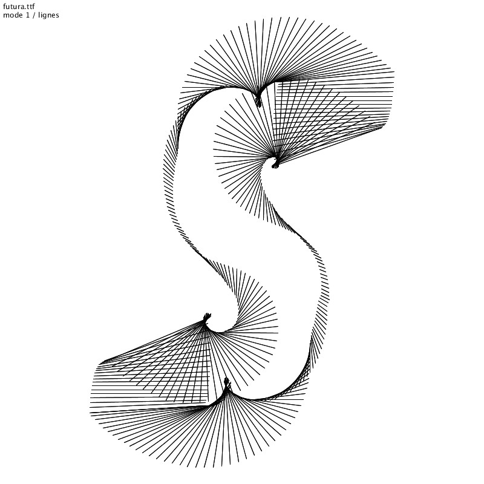
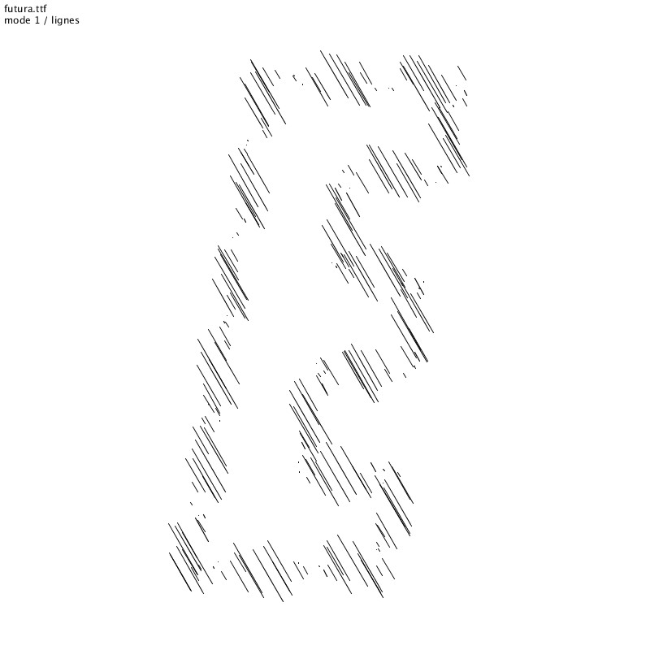
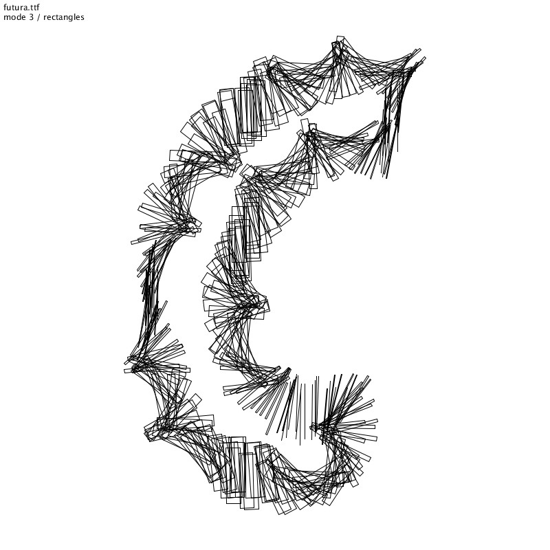
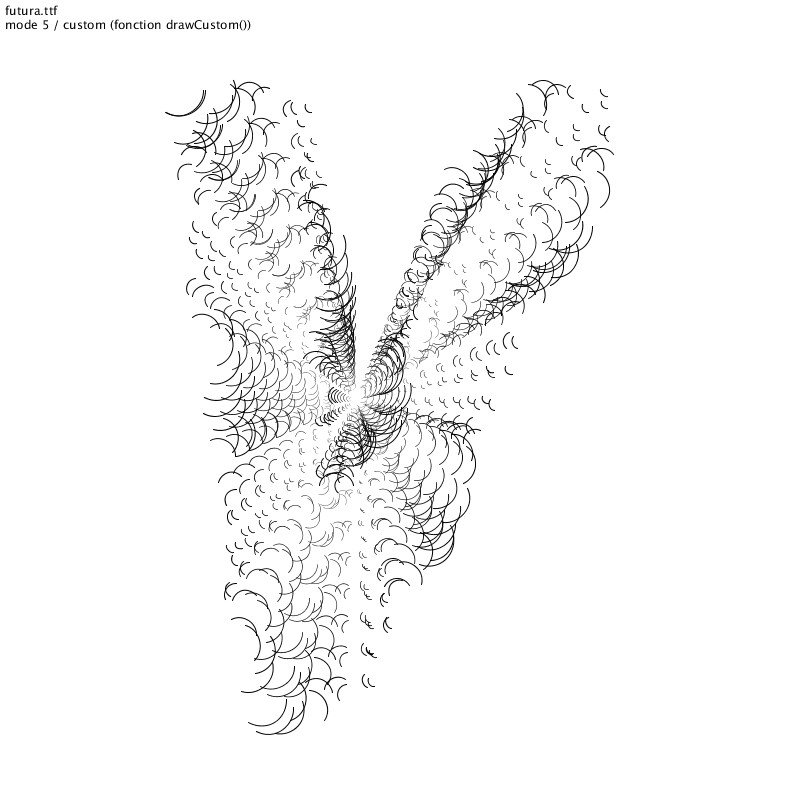

# Lettres programmées
Mini atelier à l'ECV Bordeaux en mars 2019

  

## Références
* https://www.itsnicethat.com/articles/laurent-malys-digital-graphic-design-070219  *Travail de Laurent Malys.*
* https://vimeo.com/101383026  *Generative typography with Processing*
* https://randallchurch.myportfolio.com/process-typeface *For my penultimate processing project for my class at RIT I created using naturalistic, yet strong and sharp forms with a series of particle generators. The product was a full all-caps typeface I call "Process." The output is scalable to a 4x3' print.*
* https://www.flickr.com/photos/jonobr1/sets/72157622613991424/  *Generative typography with Processing.*
* http://www.syedrezaali.com/generative-typography-experiments/  *Generative typography.*
* http://www.caligraft.com/
* https://www.behance.net/fernandDutilleux  *Blog behance de Ferdinand Dutilleux / expérimentations.*
* http://freeartbureau.org/fab_activity/typographie-generative/  *Le workshop s’attachera à présenter les bases du langage de programmation Processing et explorera les possibilités induites par la typographie générative. FAB souhaite encourager les participants à expérimenter de nouvelles possibilités formelles tout en favorisant une meilleur compréhension du code comme véritable outil créatif au sein du processus de conception.*
* https://github.com/FreeArtBureau/alphaGraph  *Alphagraph - Exploring letter forms in a parametric manner.*
* https://abduzeedo.com/node/65422  *Lemniscate Typeface by Rosy Gorolova.*
* http://generative-typografie.de/

